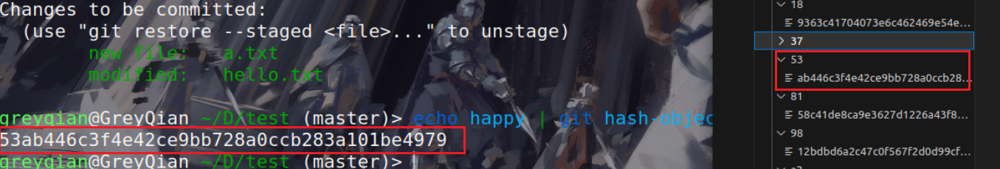

# Git

## Windows基本命令简介

- `cd`：切换目录，或者获取当前所在路径
  - 切换盘符，需要使用`D:`的方式，其中D为盘符名
- `dir`：列出当前文件列表
- `mkdir`：创建新目录
- `copy`：复制文件
- `move`：移动文件
- `del`：删除文件
- `cls`:清屏
- `exit`:退出

## 基本概念

- 基本概念
  - 工作区，写代码的地方（代码存放的位置）。在工作区操作代码是和我们平时使用是一样的，无法恢复。
  - 暂存区，对工作区`git add`之后，将内容存储到暂存区，用于临时存储内容。`git commit`之后，将暂存区的内容提交到本地库。
  - 本地库，存放着历史版本。提交到本地库的版本理论上是无法彻底删除的，都可以恢复回来。
- 代码托管中心
  - 即远程仓库，一般有如下几种
    - 局域网
      - GitLab
    - 互联网
      - GitHub
      - Gitee

## 常用命令

### 设置用户签名

```bash
git config --global user.name  用户名
git config --global user.email 邮箱
```

签名的作用是区分不同操作者的身份，以便于后续确认是谁做的提交。配置好之后，会生成`.gitconfig`的配置文件，里面存储配置的信息。**Git安装之后必须对用户签名进行配置**，且这里的用户签名与将来登陆代码托管平台的账号没有任何关系。

设置文件一般保存在`~/.gitconfig`中，隐藏命令需要`ls -a`才能查看。

注意这是全局的作者，如果针对不同的项目想换一个作者，那么我们可以使用`--local`作为参数。离开这个项目之后，还是全局作者。

```
git config --local user.name "用户名"
git config --local user.email "邮箱"
```


### 初始化本地库

```bash
git init
```

会生成一个`.git`目录，git的版本控制，全靠这个文件来实现。如果想把文件不受版本控制，最简单的方法就是把`.git`目录删除。


### 查看本地库状态

```bash
git status
```


### 添加暂存区

```bash
git add filename 添加指定文件
git add .        添加所有文件
git add --all
```

这里需要注意一个事项，如果文件有更新，那么需要先`add`在`commit`,不然可能会出现重复。宁外，`.`和`--all`的区别在于，`--all`参数，是把所有目录下的文件添加，但是`.`是把当前文件及其以下的文件都添加。

如果需要移除暂存区的内容，需要执行下面的命令

```bash
git rm --cached <filename>
```

注意移除暂存区的内容，但是对工作区的内容并没有做移除。


### 提交本地库

```bash
git commit -m "commit message"
```

commit之后，才能形成历史信息，即快照。这样才能永久化的保存信息。提交之后会生成一个7位的版本号，这个版本号可以用来对其进行一个追踪。

注意提交的内容只是刚刚`add`但是没有`commit` 的内容。

```bash
git reflog    #查看简略的log
git log       #查看详细的log
```

用于查看提交版本信息。


### 查看log

查看提交版本信息

```bash
git reflog    查看简略的log
git log       查看详细的log
```

查看某个特定作者的提交档案，其中`\|`表示或者

```bash
git log --oneline --author="GreyQian\|greyqian"
```

查找commit中包含的信息是否有某些关键字

```bash
git log --online --grep="LOL"
```

**如果只想查看某个文件的记录，可以使用下面的方法**

```bash
# 简单查看
git log 文件名
# 详细查看
git log -p 文件名
```

**查看某文件是谁写的**

```bash
git blame filename
# 特定的行是谁写的
git blame -L 起始行号,最终行号 filename
```

**版本穿梭**

```bash
git reset --hard 版本号
```

底层实际上就是对head指针的移动


### 修改文件

**删除文件**

可以先`rm`文件，然后在`git add .`将修改内容添加到暂存区，最后`commit`.

也可以方便快捷的使用`git rm 文件名`，这条命令包含了上述两条命令的总和。

如果只是想不让git追踪这个文件，而不是把它删除，可以使用如下命令，这样文件依旧还在工作区中，但是已经从本地的记录中删除了。如果文件已经`push`到远端，那文件不会在远端删除。想要在远端删除这个文件，需要在本地`rm`这个文件，然后`git add`,`git commit`之后，在推送到远端。

```bash
git rm --cached filename
```

**改文件名**

改文件名后，会被认为是把原始文件删除，然后新增了一个新的文件，文件内容相同。所以这里有两个文件变动，依旧需要使用`git add --all`.但是注意到，`git`注重的是文件内容，所以它能很轻易识别出这是只是文件名的改动。

```
On branch master
Changes to be committed:
  (use "git restore --staged <file>..." to unstage)
	renamed:    hello.txt -> 1.txt
```

> 注意改文件名，add之后该文件是renamed状态，该文件内容，add之后，文件是modified状态

**新增目录**

git在计算、产生对象的时候，是依据文件内容进行计算的。所以新增一个空目录的话，git是无法追踪到的。这不方便我们管理文件，为了解决这个问题，我们通常在文件夹下，放一个`.keep`或者`.gitkeep`文件到空文件夹下，然后就能让git追踪到它了。


### 隐藏文件

`.gitignore`文件用于记录项目目录中哪些文件被忽略，不进行同步。如果没有这个文件，我们就创建一个即可。

这个文件的一般格式如下，一般就是直接写出忽略文件的名字，可以使用正则表达式

```
# 忽略secret.yml文件
secret.yml
# 忽略所有文件后缀名为.tmp的文件
*.tmp
```

需要注意的是，这个文件仅仅针对它创建以后的文件，之前的文件并不适用。


### 版本回退

回到某一个特定的commit

```
git reset 版本号//即commit的sha值
```

以相对的方式回退

```
git reset HEAD^ //回退一个
git reset HEAD~num //回退num个
```

**回退的三种方式**

- `--mixed`
  - 也是`reset`的默认模式，这个模式，会把暂存区的文件删除而不影响工作目录。commit拆开的文件会流放在工作区，但是不会放在暂存区
- `--soft`
  - 只是head头移动了，工作区和暂存区的文件都不会被修改，commit被拆出来的文件，放在暂存区
- `--hard`
  - 无论是暂存区还是工作区的文件都删除

查看完整的log

```
git reflog
```

然后可以依据这个来进行版本的穿梭


## .git文件

`.git`文件操控着所有的版本信息，如果丢失`.git`目录，那么那个项目将变为一个普通项目。

当我们创建一个文件并把它添加到暂存区的时候，git会在`.git/object`目录下，产生一个`blob`对象。首先git会依据文件的内容，生成一个hash值，然后取其两位作为文件目录名，后面几位作为文件名置于文件目录下。但是这个文件的内容是压缩过的，因此不能直接打开。可以使用命令`git cat-file -p 哈希值`来查看内容。



这也是为什么，git无法识别空目录了，应为它里面没有文件内容。

文件目录，其对象类型是`tree`也是存放于`object`夹下，它会继续指向`tree`或者`blob`对象。即构成了我们的文件层级结构。

`commit`之后会产生`commit`对象，这个对象会指向某个`tree`对象。

然后，我们对文件内容进行一些修改，我们会发现，会生成一个新的`blob`对象。之后对新的内容进行`commit`,会生成一些新的`tree`,以用来完整的呈现目前的文件状态。这也就是为什么`git`能版本回退的原因，它对每一个`commit`状态都有完整的记录。

最后，每当给`commit`打一个标签`tag`，那么就会在`.git/tag`目录下生成一个以标签名为文件名的文件。文件内容为`hash`值，查看哈希值能查询到相关`commit`的信息，这就是为什么能通过`tag`来操作`commit`的原理。

**总结**

- 把文件加入到git之后，会转换为blob对象存储
- 目录以及文件名会被存放到tree对象中，tree对象会指向blob或者tree对象
- commit对象会指向一个tree对象，除了第一个commit对象，其他commit对象都会指向前一个commit对象
- tag对象会指向某个commit对象
- 分支指向某个commit对象
- 往远端推送成功之后，`.git/refs`目录下会增加一个remote目录，里面存放远端分支，基本上它与本地的分支一样
- 切换分支的时候，本质上就是`HEAD`指针指向了不同的commit


## Git分支操作

Git总的维护了两种指针一种是HEAD指针，只有一个，用于寻找位置等。另外一种是分支指针，每创建一个分支实际上就是创建了一个分支指针，分支指针用于跟进当前分支的情况。可以这样理解：一个仓库就是一颗树，每个分支则是不同的树枝，树枝上有不同的节点（代表每一个commit），而commit之前也有父子关系，HEAD指针则是指向commit id，HEAD所在的commit就是目前本地仓库的状态。

### 查看分支

```bash
git branch
git branch -v  
```

用于查看分支,带`*`号的为当前分支


### 创建分支

```bash
git branch 分支名
```

创建分支，本质是创建了一个新的指针，指针指向当前commit，名称为分支名

```bash
git checkout -b 分支名
```

创建并切换分支

```bash
git branch -m 原分支名 新分支名
```

切换分支名


### 删除分支

```bash
git branch -d 分支名
```

删除分支，注意未合并的分支，使用这个命令无法删除，若要删除，则需要使用`-D`参数强制删除。当然你所在的分支是不能删除的，要删除就需要调整到其他分支中再删除。

注意删除分支与创建分支对应，这里删除的仅仅只是指针，而对commit是不删除的。这也意味着，我们其实是可以将其恢复的，但是恢复的时候，需要借助它原本指向的那个hash值。

```
git branch new_branch hash_value
```

这里的hash值可以通过reflog来查看（30天之内）


### 切换分支

```bash
git switch 分支名
git checkout 分支名
```

本质上也只是HEAD指针的修改，让head指针，指向那个分支名指向的commit


### 合并分支

#### merge

```bash
git merge 分支名
```

把分支名的内容合并到当前所在的分支。

#### rebase

`git rebase`是另外一种切换分支的方式。git rebase从效果来看，就像是把另一个分支不同的部分，剪切下来，贴到另一头，类似于嫁接操作。但是略有区别，区别在于，”嫁接的枝头“commit的hash值是新创建的。原本的枝头，并不会立即消失，而是等回收机制慢慢回收，如果没有被回收，那么依旧可以恢复。

**取消rebase**

1. 使用reflog，找到切换之前那个commit,然后`git reset hasH-value --hard`强行切换
2. 直接使用`git reset ORIG_HEAD --HAED`，其中`ORIG_HEAD`是记录最近一次危险操作的commit的hash值，显然两种合并方式都属于危险操作。

> 一般而言，没有使用rebase的必要。


### 解决冲突

如果多个分支在同一个位置有不同的修改，那么就会产生冲突。如果此时合并分支的话，会报错说明存在冲突。

对于文本文件，我们可以`git status`中去查看存在冲突的内容，手动的对冲突进行修改。之后需要重新`git add 和 git commit`。

对于非文本文件，如果文件同名（也只有同名的才会冲突）,首先决定使用那个分支的文件，如果是本分支的

```bash
git checkout --ours 文件名
```

如果是被合并的分支的

```bash
git checkout --theirs 文件名
```

然后执行，`git add`,`git commit`操作


### 分支剖析

每开一个分支，相当于在`.git/refs/headers`中添加一个与分支名对应的文件。`./git/HEAD`文件中存放这当前分支的文件路径


## 标签

标签（tag）是一个指向某个commit的指示标。用于帮助我们标识一些重要的commit.例如版本号等一系列重要的内容。

**贴轻标签**

```bash
git tag "标签名" commit_hash_value
```

如果省去了hash值，默认给当前的commit打标签。轻标签不含附注，仅仅有一个别名的作用

**贴附注标签**

```bash
git tag "标签名" commit_hash_value -a -m "附注内容"
```

这样既能贴标签，还能添加一些注释信息

**删除标签**

```bash
git tag -d 标签名
```

用于删除标签

**展示标签信息**

```cpp
git show 标签名
```


## Git团队协作机制

### 团队内协作

> 一般流程为：
>
> ​	发起人push本地代码到远程仓库
>
> ​	其余开发人员clone下来，进行修改，修改之后push到远端（注意push需要开发者权限）
>
> ​	使用pull更新本地仓库代码
>
> ​	重复上述流程

### 跨团队协作

>团队1现在已经有完备的项目A，团队B想和帮助团队A进行新的拓展开发
>
>​	团队B fork 项目A到自己的远程仓库
>
>​	团队B clone到本地开发
>
>​	团队B push 到远端，并提交pull request
>
>​	团队A同意之后进行merge到自己的远程库
>
>​	然后团队A pull到自己的本地继续进行开发


## GitHub操作

### 新建项目的工作流

要上传文件到GitHub，首先我们需要在上面新建一个项目，**注意建议创建项目的时候，不要选择创建readme文件，这会给后续带来一点麻烦，建议在本地写readme文件上传**。

之后有两种方式：

- 直接在本地初始化项目，然后选择上传
- 克隆仓库到本地，修改后上传

#### 本地初始化

首先在本地创建一个文件夹，用于存放自己的项目。然后创建一个readme文件，这里简单写上readme文件的标题就可以了，内容后续添加。之所以要写一个标题，是因为`git`是以文件的内容来区分文件的。

例如：`echo "# Tools" >> README.md`

随后就是初始化仓库

```bash
git init
git add README.md
git commit -m "first commit"
```

然后，应为现在`github`的默认分支是`main`分支，而本地是`master`分支，因此建议将本地分支改名为`main`这样在后续`push`的时候简单很多。

```bash
git branch -M main
```

添加远程仓库,并命名为`origin`，这里命名不限制，但是需要注意与操作后续统一即可

```
git remote add origin https://github.com/GreyQian/Tools.git
```

第一次推送的时候，建议加上`-u`参数。这样后续就能直接使用`git push`就可。

```bash
git push -u origin main
```


#### 克隆仓库

克隆操作相对来说，简便了很多。因此建议使用克隆操作。操作如下：

```bash
#直接
git add .

git commit -m ""

git push
#即可方便的完成
```


### 远程库操作

#### 创建远程库别名

```bash
git remote -v 							查看当前所有远程库的别名
git remote add 别名 远程仓库地址		   给远程库设置一个简短的名字
```


#### 推送本地分支到远程仓库

推送到远端是以分支为单位推送的

```bash
git push 别名(或远端网址) 分支
```

如果第一次使用了`-u`参数，这就意味着对于这个分支，默认推送到这个别名上。以后在这个分支上只需要使用`git push`即可默认按照这个参数推送。否则，每次都要指明分支和远端别名。

注意这种方法实际上是一种缩写，以`git push origin master`,它本质上是`git push origin master:master`即默认远端的分支和本地的分支名保持一致。如果不想这样定义的话，可以使用下面的方法，指定分支

```bash
git push origin master:cat
```

这就说明将本地的master分支,推送到远端并命名为cat分支

**多人一起协作的时候，可能出现，远端的内容优先于自己本地的内容，这个时候，需要先拉取到本地，然后合并冲突。做了修改之后，再将其推送上去**


#### 克隆

```bash
git clone 远程仓库网址
```

克隆会在本地做下面三件事

- 拉取代码
- 初始化本地仓库
- 创建别名，别名自动设置为`origin`


#### 拉取远程库内容

```bash
git fetch
```

当git push之后，远端也有着相应的HEAD,和分支名，名为`origin/HEAD`,`origin/master`（在本地也开了一个分支用于记录）。这个时候，如果对远端的内容有所修改，然后并`commit changes`相当于在远端做了一次提交。这个时候，远端比本地多出来了一些commit,git fetch就用于拉取这些区别，然后让本地的远程分支（orgin/master），移动到最新的commit,与远端实现了同步。

本地分支为了能与远端分支保持同步，那么只需要将其合并即可。

因此`git pull=git fetch+git merge`

```bash
git pull 别名(远程仓库网址) 分支名
```

可能会出现拉取不了的情况，这个时候要么在`TUN`网卡模式开`VPN`，要么使用以下命令

```bash
git config --global http.sslVerify "false"     修改设置，解除ssl验证
```

如果是两个不相关的仓库可能会无法拉取，因为git会认为这两个仓库不是同一个，为了防止开发者上传错误，于是就给下面的提示

```
fatal: refusing to merge unrelated histories
```

如我在Github新建一个仓库，写了License，然后把本地一个写了很久仓库上传。这时会发现 github 的仓库和本地的没有一个共同的 commit 所以 git 不让提交，认为是写错了 `origin` ，如果开发者确定是这个 `origin` 就可以使用 `--allow-unrelated-histories` 告诉 git 自己确定。就能合并了。


### SSH免密登陆

Git有两种clone代码的方式，一种是http，一种是ssh。使用SSH免密登陆，将账号信息配置在自己电脑本地就能每次省去了繁琐的登陆验证步骤。具体需要按照如下步骤添加SSH生成密钥。

首先进入到用户目录，可能会有已经配置好的内容，先将其删除

```bash
rm -rvf .ssh
```

创建SSH key。执行命令下面命令，点击三次回车！

```
ssh-keygen -t rsa -C 任意内容
```

然后会生成`.ssh`文件，`id_rsa`是公钥，`id_rsa.pub`是私钥。

然后复制公钥到GitHub上


