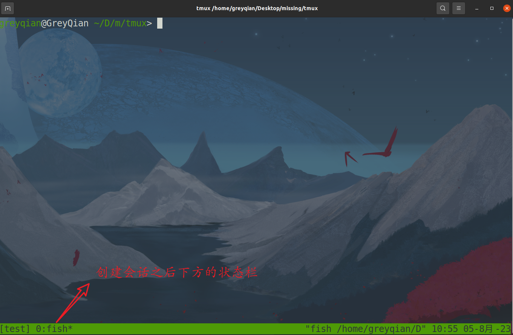
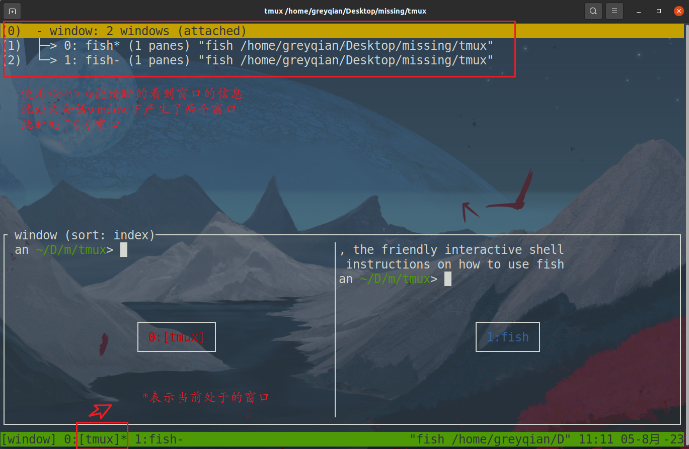
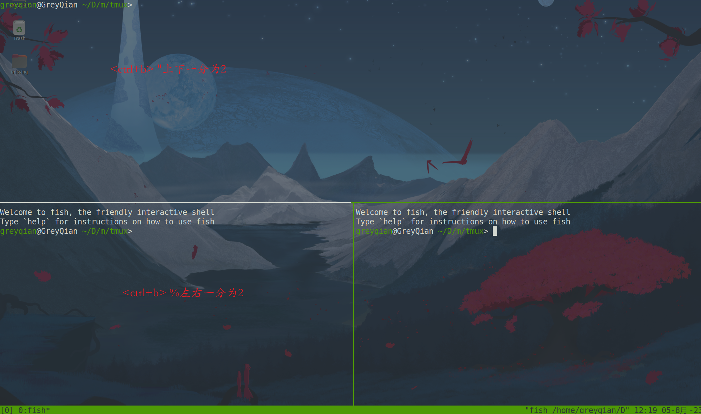

# Tools In Shell

> 这里主要介绍一些Linux shell中会使用的工具

## Shell

> Shell指的是操作系统提供的命令行界面（Command-Line Interface，CLI）。通俗的来说，它是一种解释器，能将我们输入的自然语言转换为能让操作系统理解的指令（编程）语言。

### 基础概念

常见的shell主要有：

- bash：unix默认的shell
- Zsh：可定制化程度高，可以轻易定制为自己喜欢的shell风格
- fish：对历史命令有着较好的保存，能方便调用
- Power Shell：Windows上的主流Shell

在 shell 中，命令是通过空格或制表符来分隔的，第一个参数通常是命令名称，后面的参数是传递给该命令的参数。Shell 会解释用户输入的命令并将其分割成命令名称和参数，然后执行相应的命令。**如果需要使用空格，应该使用转义符号`\`或者使用`" "`来将其括起来**

例如：

```shell
mkdir day 01 #创建了两个文件夹01 day
mkdir day\ 01 #只创建一个文件，文件包含空格
```

通常而言，命令参数之后会有选项参数，它们以`-`或`--`开头，用于表示一些特殊的作用。其中`-`主要后面紧跟单字符，随着选项的丰富发展单字符不太够用，拓展出多字符，并使用`--`来区分。

选项参数可以出现在任何位置，但是我们通常将其放在紧跟命令参数之后，其他位置参数之前。

### 一些技巧

shell本质上也是一种编程环境，她具备变量，条件，循环等。当在shell中执行某个指令的时候，如果这个指令不是shell所了解的关键字，那么它会去咨询环境变量`$PATH`。`$PATH` 中有一系列由`:`分割的路径，shell会这些路径下寻找是否在该命令。当然我们也可以使用which命令来查看，命令所在的位置

```shell
greyqian@GreyQian ~/Desktop> echo $PATH
/usr/local/sbin /usr/local/bin /usr/sbin /usr/bin /sbin /bin /usr/games /usr/local/games /snap/bin
greyqian@GreyQian ~/Desktop> which echo
/usr/bin/echo
```

在Linux中支持使用相对路径和绝对路径，`.` 表示当前路径，`..`表示父目录路径。


shell中我们还能使用通配符，例如`*`。来帮助我们进行匹配。当有一系列的指令，其中包含一段公共子串的时候，我们可以使用花括号来自动展开这些命令

例如：

```bash
convert image.{png,jpg}
convert image.png image.jpg


mv *{.py,.sh} folder #将所有的.py和.sh文件移动到folder中
```


### shell工具

#### 命令查看工具

**man手册**

使用`man 命令`能查看命令的使用语法，或者使用`命令 --help`也可以。但是有些时候，`man`手册上的内容太多，可以考虑使用下面的工具


**tldr**

使用方法：

```shell
tldr 命令
```


#### 查找文件

**find**

find命令有着很多很强大的功能，再使用的时候我们可以使用`tldr`来查看，并帮助我们解决问题。但是，我们还可以使用更简单的命令


**fd**

**基本语法**：

```shell
fd [options] [pattern] [search_directory...]
```

- `options`: 可选的命令行选项，用于指定搜索的条件和行为。
- `pattern`: 要匹配的文件名或目录名的模式，可以是普通字符串或正则表达式。
- `search_directory`: 可选参数，要在哪些目录中进行搜索。如果不指定，默认为当前目录。

**常见使用方法**

查找当前目录及其子目录中名为 "example.txt" 的文件：

```shell
fd example.txt
```

查找指定目录（例如`/path/to/dir`）中名为 "search" 的文件或目录：

```shell
fd search /path/to/dir
```

当然其支持通配符和正则表达式，还能支持查询的深度，详细的用法可以询问chatgpt


#### 查找代码

**grep**

常用于在文件或标准输入中查找匹配特定模式的文本行。

语法：

```shell
grep [options] pattern [file...]
```

- `options`: 可选的命令行选项，用于指定搜索的条件和行为。
- `pattern`: 要搜索的字符串或正则表达式模式。
- `file`: 可选参数，要在其中搜索的文件名。如果不指定文件名，`grep` 将读取标准输入。

常用用法：

1. 在文件中查找特定字符串：

   ```shell
   grep "search_string" file.txt
   ```

2. 使用正则表达式进行搜索：

   ```shell
   grep "pattern" file.txt
   grep -E "regex_pattern" file.txt   # 使用扩展正则表达式
   ```


**ripgrep**

ripgrep是一款具有和grep功能相同的工具，但是它更加强大与方便。下面是常见的使用场景与方法

1. 在当前目录递归搜索匹配的文本：

   ```shell
   rg "pattern"
   ```

2. 在指定的目录递归搜索匹配的文本：

   ```shell
   rg "pattern" /path/to/directory
   ```

3. 使用正则表达式进行搜索：

   ```shell
   rg -e "regex_pattern" /path/to/directory
   ```

4. 忽略大小写进行搜索：

   ```shell
   rg -i "pattern" /path/to/directory
   ```

5. 查找整个单词匹配：

   ```shell
   rg -w "word" /path/to/directory
   ```

​             


#### 查找shell命令

使用上方向键能显示你上一条使用的命令，一直使用就能遍历你使用的所有命令

`history`命令能显示出我们使用过的历史命令，通常使用history和grep以及管道相结合，来快速定位到某条历史命令

```shell
history | grep find
```


#### 文件夹导航

**fasd(待开发)**

`fasd` 是一个用于快速访问和管理文件和目录的命令行工具。以下是其常用的使用方法：

添加文件或目录到快速访问列表：

使用 `fasd` 命令加上 `-a` 选项，后接文件或目录的路径，将其添加到快速访问列表中。

```shell
fasd -a /path/to/file
fasd -a /path/to/directory
```

快速切换目录：

使用 `fasd` 命令的 `-d` 选项，后接模糊匹配的目录名，即可快速切换到该目录。

```
bashCopy code
fasd -d example
```

快速打开文件：

使用 `fasd` 命令的 `-f` 选项，后接模糊匹配的文件名，即可快速打开该文件。

```
bashCopy code
fasd -f example.txt
```


## Shell 脚本(待完成)

shell包括一套自己的变量，控制流，语法。使用这些语法能够帮助我们写出自动运行的脚本。shell脚本针对shell的环境，从标准输入中读取输入并将其进行相应的逻辑操作，使用自动化的方式来代替我们重复的敲一些命令。这里主要针对bash脚本

### 变量

shell中的变量主要分为四种

- 位置参数变量
  - `$0`: 当前脚本的名称。
  - `$1`, `$2`, ...: 第 1、2、... 个位置参数（命令行参数）。
  - `$*` 或 `$@`: 所有位置参数的列表。
  - `$#`: 位置参数的数量。
- 系统环境变量
  - `$PATH`: 用于查找可执行程序的路径列表。
  - `$HOME`: 当前用户的主目录。
  - `$USER`: 当前用户名。
  - `$PWD`: 当前工作目录。
  - `$SHELL`: 当前 shell 的路径。
- 特殊变量
  - `$$`: 当前 shell 进程的 PID。
  - `$?`: 上一个命令的退出状态码。
  - `$!`: 上一个后台运行的进程的 PID。
- 用户自定义变量
  - 用户自己定义的变量，赋值语法为`foo=bar`需要注意的是，因为解释器会使用空格分割参数，因此中间不能有空格
- 字符串
  - bash中的字符串使用`''`或者`" "`来分割，但是需要注意的是，`''`中的内容，是原意字符串，不会惊醒转意。但是`" "`中的字符串，会进行转义执行相应的操作。

通常而言，命令会使用`STDOUT`来返回相应的输出值，使用`STDERR`来返回错误以及错误码。返回码可以作为判断命令是否成功的重要依据，我们可以使用命令`echo $?`来查看返回值，**返回0表示正常执行，其他非0的返回表示出现错误。**

当然我们也可以将返回码使用逻辑操作符`&&`,`||`来使用。达到逻辑控制的目的

例如

```bash
false || echo "Oops,fail"
```

**如果在一行中想使用多个命令，可以使用`;`来分割命令**，例如

```bash
false;echo "this is always run"
```


### 函数

语法：

```bash
function_name() (
    # 命令1
    # 命令2
    # ...
)
```

调用方法

```bash
函数名 参数列表		#参数列表以空格分割
```


### 逻辑语句

**`if`语句**

```bash
if [ 条件 ]; then
    # 条件为真时执行的命令
else
    # 条件为假时执行的命令（可选）
fi
```

注意，`[ 条件 ]` 中的空格是必需的，以及 `then` 和 `fi` 都是关键字，必须用空格与其他代码分隔开。


**`for`循环语句**

用于遍历列表元素的一系列操作

```bash
for 变量名 in 列表; do
    # 循环体，可以使用 $变量名 来引用当前迭代的元素
done
```


**`while`循环语句**

```bash
while [ 条件 ]; do
    # 循环体
done
```


**`case`条件语句**

```bash
case 变量 in
    模式1)
        # 匹配模式1时执行的命令
        ;;
    模式2)
        # 匹配模式2时执行的命令
        ;;
    *)
        # 默认情况下执行的命令（可选）
        ;;
esac
```

例如：

```bash
read -p "Enter a fruit: " fruit

case "$fruit" in
    "apple")
        echo "It's an apple."
        ;;
    "banana")
        echo "It's a banana."
        ;;
    *)
        echo "Unknown fruit."
        ;;
esac
```


### shebang

在Shell脚本中，shebang（也称为hashbang）是一种位于脚本文件开头的特殊注释行，用于指定脚本的解释器路径。当你在Shell脚本的第一行添加shebang时，告诉操作系统要使用指定的解释器来运行这个脚本。

使用shebang能指明应该使用哪个解释器来执行该脚本，提高了程序的可移殖性。并且方便执行，你不需要再指明使用哪个解释器来执行该脚本，仅仅只需要通过`./filename`的形式就可以运行该文件。例如：在没有shebang的情况下，你需要使用 `sh script.sh` 或 `bash script.sh` 命令来执行脚本。而有了shebang后，可以直接用 `./script.sh` 来执行，更加方便。

**语法**

```bash
#!/path/to/interpreter
```

其中 `#!` 就是shebang的标志，紧接着是指定解释器的绝对路径。

例如：

如果要使用Python解释器，shebang 将是：

```bash
#!/usr/bin/python
```


## 数据整理工具

### sed

`sed`是一个功能强大的流式文本编辑器，当我们需要处理文件内容但是却不想打开文件而使用命令行直接修改文本内容的时候，我们可以和借助`sed`帮我们实现该内容。它从输入流（通常是文本文件或标准输入）逐行读取文本，然后根据提供的命令对文本进行编辑，并将处理后的文本输出到标准输出或指定的文件。**当不提供文件的时候，默认认为是从标准输入获取数据**

**语法**：

```shell
sed [options] 'command' input_file
```

- `options`: 可选的命令行选项，用于指定 `sed` 的行为和编辑模式。
- `'command'`: 由一个或多个 `sed` 命令组成的编辑脚本，指定要对文本进行的编辑操作。
- `input_file`: 可选参数，指定要处理的输入文件。如果不提供输入文件，`sed` 将从标准输入读取数据。

**常见用法**

1. 替换文本中的字符串：

   ```shell
   sed 's/old_string/new_string/' input.txt
   ```

   这将将 `input.txt` 文件中的第一个匹配到的 `old_string` 替换为 `new_string`。

2. 全局替换文本中的字符串：

   ```shell
   sed 's/old_string/new_string/g' input.txt
   ```

   这将将 `input.txt` 文件中所有匹配到的 `old_string` 全部替换为 `new_string`。

3. 删除特定行：

   ```shell
   sed '3d' input.txt
   ```

   这将删除 `input.txt` 文件中的第三行。


### awk

Awk是一种强大的文本处理工具，它在Unix和类Unix系统上广泛使用。它的名称来源于它的三位创建者：Alfred Aho、Peter Weinberger和Brian Kernighan。Awk主要用于处理结构化文本数据，它可以从文件、标准输入或管道中读取数据，并对数据进行处理、过滤、格式化和报告。

Awk的基本工作原理如下：

1. 读取输入文本，按照指定的分隔符将每一行分割成字段（默认的分隔符是空格）。
2. 对每一行执行用户定义的操作，通常是在每个字段上进行计算或处理。
3. 输出结果，通常是在终端上显示，也可以重定向到文件中。

Awk的工作方式可以通过一个简单的命令行结构来表示：

```shell
awk 'pattern { action }' input_file
```

- `pattern`：是一个条件表达式，用于选择要执行`action`的行。如果省略`pattern`，则默认匹配所有行。
- `action`：是要在满足`pattern`的行上执行的操作，可以是数学计算、打印输出等。
- `input_file`：是输入文件的名称。如果不指定`input_file`，Awk将从标准输入读取数据（通常是键盘输入或通过管道提供的数据）。


## 命令行环境

### 任务控制

#### 结束进程

shell会使用unix提供的信号机制执行进程间的通信。当一个进程接收到信号的时候，他会停止执行、处理该信号并基于信号传递的信息来改变其执行。

通常而言，当我们按下`ctrl-c`的时候，shell会发送一个`SIGINT`信号到进程，以终止进程。当然我们也可以使用`ctrl-\`来发送一个`SIGQUIT`来终止进程。

当然还可以使用`kill pid`的方式来向进程发送`sigterm`信号，用于终止进程

#### 暂停和后台执行进程

使用`ctrl-z`会让shell发送`SIGSTEP`信号，让进程暂停。

使用`fg`或者`bg`命令可以恢复暂停的工作。他们分别表示再前台继续或者在后台继续工作。

使用`jobs`命令，可以列出当前终端会话中尚未完成的全部任务。

无论是前台或者后台的进程都是终端上的子进程，一旦关闭终端，会发送一个`SIGHUP`的信号，该信号的一般作用就是通知进程终端连接已经断开，并终止进程。可以使用`nohop`命令来防止发送`SIGHUP`信号。


### 别名

当命令太长的时候，不便于书写，可以使用命令来代替这个长命名。命名的用法为

```shell
alias short_command="long_command"
```

例如：

```shell
alias ll="ls -lh"
```

查看某个别名的意义

```shell
alias ll
```

取消某个别名

```shell
unalias ll
```


### 配置文件

很多程序的配置都是通过点文件（以`.`开头的文件）来完成的。这种文件一般是隐藏文件。常见的配置文件入下：

- `bash` - `~/.bashrc`, `~/.bash_profile`
- `git` - `~/.gitconfig`
- `vim` - `~/.vimrc` and the `~/.vim` folder
- `ssh` - `~/.ssh/config`
- `tmux` - `~/.tmux.conf`

当然也正是因为如此，当我们更换到新的环境中时，可以使用git版本控制我们的配置文件，然后直接到二u就可以了，避免了重复的配置。


## 终端多路复用

`tmux`是一个终端复用工具。它分为三个部分，分别为session（会话），window（窗口），pane（面板）。当我们创建了一个会话之后，我们就能创建多个窗口，每个窗口都是单独的沾满整个屏幕，如果我们想对屏幕进行分割，那么我们可以使用pane（面板）分割多个窗口。

> 这里说明一种格式`<c-b> x`意味着按下ctrl+b之后释放，然后再按下x

### 会话

**创建会话**

````shell
tmux new -s name
````

用于创建一个有名字的会话，如果不想创建名字，就使用`tmux`就可以创建一个没有名字的会话



**断开当前会话**

可以使用`<c-b> d`,断开会话，并在后端运行。

**进入之前的会话**

```shell
tmux a -t session_name
```

使用`tmux a`默认进入第一个

**关闭会话**

关闭会话之后，会话进程终止。会话消失

```shell
tmux kill-session -t session_name
```

如果想全部关闭，使用`tmux kill-server`

**查看已经创建的会话**

```shell
tmux ls
```


### 窗口

|   前缀   | 指令  |                    描述                    |
| :------: | :---: | :----------------------------------------: |
| `Ctrl+b` |  `c`  |                  新建窗口                  |
| `Ctrl+b` |  `&`  | 关闭当前窗口（关闭前需输入`y` or `n`确认） |
| `Ctrl+b` | `0~9` |               切换到指定窗口               |
| `Ctrl+b` |  `p`  |               切换到上一窗口               |
| `Ctrl+b` |  `n`  |               切换到下一窗口               |
| `Ctrl+b` |  `w`  |        打开窗口列表，用于且切换窗口        |
| `Ctrl+b` |  `,`  |               重命名当前窗口               |
| `Ctrl+b` |  `.`  |   修改当前窗口编号（适用于窗口重新排序）   |
| `Ctrl+b` |  `f`  |  快速定位到窗口（输入关键字匹配窗口名称）  |



一般情况下，我们就会使用到多个窗口。常见的命令就是`<c-b> c`创建窗口，然后使用`<c-b> 数字`切换窗口，然后使用`<c-b> &`关闭窗口。就避免了繁杂的切换终端。


### 面板

面板是使用最多的技巧 ，当我们想要在同一个窗口上处理不同的程序，但是又想要看到当前的结果，我们可以使用面板的功能，其直观的效果就是类似于Windows的分屏功能。

|   前缀   |   指令   |                           描述                           |
| :------: | :------: | :------------------------------------------------------: |
| `Ctrl+b` |   `"`    |            当前面板上下一分为二，下侧新建面板            |
| `Ctrl+b` |   `%`    |            当前面板左右一分为二，右侧新建面板            |
| `Ctrl+b` |   `x`    |        关闭当前面板（关闭前需输入`y` or `n`确认）        |
| `Ctrl+b` |   `z`    | 最大化当前面板，再重复一次按键后恢复正常（v1.8版本新增） |
| `Ctrl+b` |   `;`    |                 切换到最后一次使用的面板                 |
| `Ctrl+b` | `方向键` |                     移动光标切换面板                     |




### 使用流程

通常而言，我们会创建一个会话，以会话名的形式创建能更有条理性，方便管理。

```shell
tmux new -s session_name
```

创建一个会话会默认创建一个窗口，如果想并行处理某些操作可以创建窗口

`<ctrl b> c`创建窗口

`<ctrl b> &` 关闭窗口

`<ctrl b> 数字`切换窗口

如果在窗口上想分屏

`<ctrl b> "`向下分屏

`<ctrl b> %`向右分屏

`<ctrl b> x`关闭该面板

最后`<ctrl b> d`退出会话，如果想要关闭会话使用`tmux kill-sever`

**翻页：使用`<ctrl b> [`，然后才能进入翻页模式，使用上下键操控翻页，q退出翻页**


## 远端控制

使用`ssh`可以进行远端控制。

### 连接主机

```shell
ssh 用户名@服务器ip地址（或者域名）
```

ssh默认使用22号端口，如果想要指定端口号，使用下面的内容

```shell
ssh -p 端口号 用户名@服务器ip地址（或者域名）
```

使用`exit`或者`ctrl+d`退出

### 执行命令

可以使用`ssh`命令在远程主机上执行命令，而无需登录到远程主机。语法如下：

```bash
ssh [user@]hostname <command>
```

这样可以直接在远程主机上执行指定的命令，并将结果输出到本地主机上。

### ssh密钥

使用SSH的密钥认证方式比密码更安全，可以通过以下方法生成和使用密钥：

- 生成密钥对：

  ```shell
  ssh-keygen
  ```

- 将公钥复制到远程主机：

  ```shell
  ssh-copy-id [user@]hostname
  ```

这将把本地生成的公钥复制到远程主机上，使得密钥认证可用。

### 复制文件

`rsync`是一个强大的文件同步工具，能够在本地主机和远程主机之间同步文件和目录。当然我们也可以使用XFTP这个软件来帮忙传输文件。

 在命令行中使用`rsync`命令来复制文件。语法如下：

```shell
rsync [options] <source> [user@]hostname:<destination>
```

- `<source>`：要复制的源文件或目录路径。
- `[user@]hostname`：远程主机的用户名和主机名或IP地址。
- `<destination>`：目标文件或目录路径，指定在远程主机上的位置。

如果要**复制整个目录**及其内容，可以在`source`参数中指定目录路径：

```shell
rsync -r /path/to/local/directory/ user@hostname:/path/to/remote/
```

### 端口转发

 SSH支持本地端口转发和远程端口转发，可用于建立安全通道。语法如下：

- 本地端口转发：

  使用本地端口转发时，数据流向如下：`本地主机端口 -> SSH加密通道 -> 远程主机目标端口 `

  ```shell
  ssh -L <local_port>:<target_host>:<target_port> [user@]hostname
  ```

- 远程端口转发：

  远程主机端口 -> SSH加密通道 -> 本地主机目标端口 

  ```shell
  ssh -R <remote_port>:<target_host>:<target_port> [user@]hostname
  ```

这样可以在本地主机和远程主机之间建立安全的通信通道，用于代理服务或绕过防火墙等应用。

### 配置

有些时候，需要输入ip或者域名和繁杂。可以退通过更改配置文件，来减少这些步骤


## 调试及性能分析（待补全）

### 调试

> 最有效的debug工具就是细致的分析，配合恰当位置的打印语句。

调试代码的第一种方法往往是在发现问题的地方添加一些打印语句，然后不断重复此过程直到细化到具体出现问题的地方

打印调试的时候可以加上不同的颜色，使其更加明显

### 日志

可以通过查看第三方日志来帮助定位到错误。对于unix系统来说，程序的日志通常放在`/var/log`中。

systemd 是一个系统和服务管理器，是 Linux 系统中广泛采用的初始化系统和守护进程管理器。systemd 进程是 systemd 系统管理器本身运行的进程，它是 PID 1 进程，即第一个运行的进程，负责启动和管理其他系统进程和服务。**当系统出现问题的时候，我们应该去查看该进程的日志，该日志位于`/var/log/journal`**中

使用 `journalctl` 来查看 systemd 的日志非常简单。以下是一些常用的 `journalctl` 命令：

1. **查看所有日志：**

   ```shell
   journalctl
   ```

   这将显示所有的系统日志，包括内核消息和用户空间的日志。

2. **查看特定单元的日志：**

   ```shell
   journalctl -u unit_name
   ```

   这里将 `unit_name` 替换为你要查看的特定系统服务或进程的名称，如 `sshd`、`httpd` 等。

3. **按时间查看日志：**

   ```shell
   journalctl --since "yyyy-mm-dd HH:MM:SS" --until "yyyy-mm-dd HH:MM:SS"
   ```

   这里将 `yyyy-mm-dd HH:MM:SS` 替换为你要查看的起始时间和结束时间，可以按照特定时间范围来过滤日志。

4. **查看最近的日志：**

   ```shell
   journalctl -n 100
   ```

   这将显示最近的 100 条日志记录。

5. **按优先级查看日志：**

   ```shell
   journalctl -p priority_level
   ```


### 调试器

C语言使用gdb调试，或者更加先进的pwngdb调试

python使用pdb调试


### strace

使用`strace`来追踪系统调用。

查看网络问题，需要使用`tcpdump`和`wireshark`


### 性能分析

这是一些关于分析性能的工具

（待补全）


## 元编程

### 系统构建

#### make

`make`是最常用的构建系统之一，它能够很好的是适用于中小型系统的构建。当执行`make`的时候，它会去参考当前目录下的`Makefile`文件。所有的构建目标，相关的依赖项都需要在该文件中定义。


#### 版本号

常见的版本号通常由如下形式构成：主版本号.次版本号.补丁号

相关规则如下：

- 如果新版本没有改变API，补丁号递增
- 如果添加了API并且API可以向下兼容，那么次版本号递增
- 如果修改了API但是它不向下兼容，那么主版本号递增

例如：

Python 2 和 Python 3 的代码是不兼容的，这也是为什么 Python 的主版本号改变的原因。类似的，使用 Python 3.5 编写的代码在 3.7 上可以运行，但是在 3.4 上可能会不行。


## 杂项

### 键位映射

下面是一些修改键位映射的软件：

- macOS - [karabiner-elements](https://pqrs.org/osx/karabiner/), [skhd](https://github.com/koekeishiya/skhd) 或者 [BetterTouchTool](https://folivora.ai/)
- Linux - [xmodmap](https://wiki.archlinux.org/index.php/Xmodmap) 或者 [Autokey](https://github.com/autokey/autokey)
- Windows - 控制面板，[AutoHotkey](https://www.autohotkey.com/) 或者 [SharpKeys](https://www.randyrants.com/category/sharpkeys/)
- QMK - 如果你的键盘支持定制固件，[QMK](https://docs.qmk.fm/) 可以直接在键盘的硬件上修改键位映射。保留在键盘里的映射免除了在别的机器上的重复配置。


