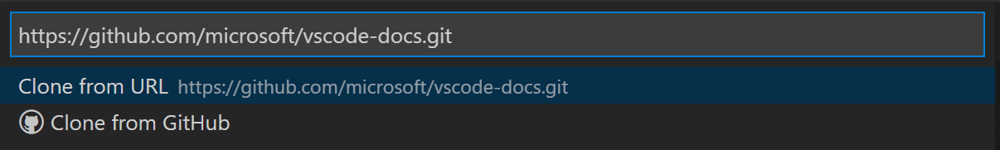
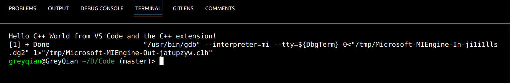
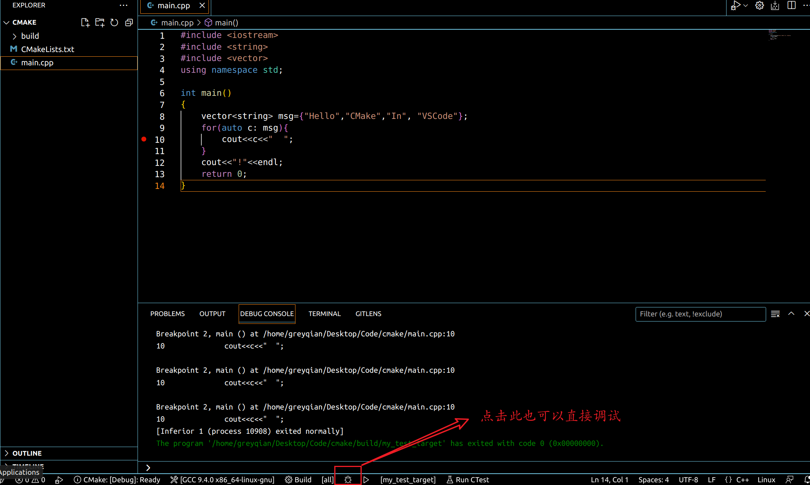

# VSCode使用教程

> vscode的用户配置文件以及数据放在如下的文件目录下，如果想彻底删除，需要将数据文件夹`Code`和`.vscode`删除。这才能让你回到最初始的状态。
>
> - **windows**：删除`%APPDATA%\Code`和`%USERPROFILE%\.vscode`
> - **linux**：删除 `$HOME/.config/Code` 和 `~/.vscode`.
> - **macOS** - 删除 `$HOME/Library/Application Support/Code` 和`~/.vscode`.

**推荐学习资料**：

[官方文档](https://code.visualstudio.com/docs/)

**目录**

[TOC]

## 下载安装

安装教程很多，这里就不赘述了。可以自行Google。

当我们需要打开项目的时候，通常有三种方法

1. 拖拽到文件夹到vscode中
2. 在`file->open`中打开文件夹
3. 使用`code`命令，直接从命令行打开文件

code命令是vscode自带的一个命令，通常在window和Linux下会自动安装完成，mac下需要自己安装。其常见的使用方法如下：

```shell
# 打开当前文件夹
code .
# 打开指定的目录或者文件
code {path}
# 创建一个新的窗口
code -n
# 查看文件差异
code --diff file1 file2
# 禁止所有拓展
code --disable-extension .
# 查询帮助
code --help
```


## 页面布局和功能介绍

VSCode用户页面主要由五部分组成，分别如下：

1. Status Bar（状态栏），用于显示当前被打开文件的一些信息。
2. Activity Bar（活动栏），它里面包含了VS Code重要功能的入口点。
3. Activity Bar旁边的Side Bar（侧边栏），它里面包含了Activity Bar五个功能点的详细内容。
4. Editor（编辑器），用于编写代码。这里可以垂直和水平展开任意数量的编辑器
5. Panels（面板），它包含了4个不同的面板，其中的Terminal面板我们会经常用到。


### 编辑区

#### 并排编辑

可以通过如下方法经行垂直展开：

- `alt`并点击想要展开的文件
- `ctrl+\`将页面编辑器分为两部分
- 点击文件名，右键，可以看到各种拆分方式
- 点击小图标分栏


这些分栏可以任意拖拽。如果想要修改其在底部分栏，需要设置 `workbench.editor.openSideBySideDirection` 。当打开多个编辑器的时候，使用`ctrl+数字`可以切换他们。


当然你也可以拖动他们，类似于windows的分屏一样。


#### 小地图

在右侧有一个小地图，可以拖动其使之快速移动代码。可以将小地图移动到左侧，也可以通过分别设置或在 `"editor.minimap.enabled": false` 用户或工作区设置 `"editor.minimap.side": "left"` 中完全禁用它。

### 资源管理器

资源管理器用于浏览、打开和管理项目中的所有文件和文件夹。我们可以使用`ctrl+p`快速搜索和打开文件。默认情况下，vscode会忽略`.git`等类型的文件，如果想要修改规则可以在`file.exclude`中配置。

当我们想要在资源管理器中查找某个文件名的时候，我们可以在资源管理器的`side bar`中按下`ctrl+f`来查询

资源管理的功能被分为了三个部分，分别是：

- 已经打开的文件（open editors）,在这里我们可以一键关闭所有当前被打开的文件。
- 项目本身
- outline：它能给我们以树的形式，展开该文件代码中的结构。例如：如果使用面向对象语言就会显现各种对象，以及其的方法和变量。**点击可以快速跳转到这部分**


### 搜索工具

这里主要提供了搜索功能，可以使用正则语法。高级设置可以设置是否大小写敏感等操作。上方的用于查找，下方的用于替换。这里的搜索是整个文件夹的全局搜索，如果只是想在某个文件中搜索，可以在文件中使用`ctrl+f`即可。


版本控制和插件和debug将在后面展示。

**如果想要查找多行的内容需要使用`ctrl+enter`换行**

正则语法简略：

- `*` 匹配路径段中的零个或多个字符
- `?` 匹配路径段中的一个字符
- `**` 匹配任意数量的路径段，包括无路径段
- `{}` 对条件进行分组（例如 `{**/*.html,**/*.txt}` ，匹配所有 HTML 和文本文件）
- `[]` 声明要匹配的字符范围（ `example.[0-9]` 匹配 、 `example.0` 、 `example.1` ...
- `[!...]` 否定要匹配的字符范围（匹配 `example.a` 、 `example.b` 但不 `example.[!0-9]` 匹配 `example.0` ）

## 版本控制

### 环境搭建

在Linux安装Git，我们可以通过下面这条命令：

```shell
sudo apt update && sudo apt install git -y
```

完成配置

```shell
git config --global user.name "your name" 
git config --global user.email "your@example.com"
```

*将`your name`替换成你自己的Github用户名，将`your@example.com`替换成注册Github时填写的邮箱。*

使用`ssh`生成自身的公钥

```shell
ssh-keygen -t rsa -b 4096 -C "your_email@example.com"
```

查看公钥然后将公钥添加到github中

```shell
cat ~/.ssh/id_rsa.pub
```

使用命令测试连接：

```shell
ssh -T git@github.com
```

### 实用技巧

> 在vscode之中基本上各个命令都有相应的选项，可以帮助我们省略了使用命令行来进行版本控制的流程。

#### 常见知识

- 常见命令：
  - git init：用于初始化一个Git仓库
  - git status：用于查看当前Git状态
  - git add：它的使用场景有三个：1、将一个尚未被Git跟踪的文件纳入Git跟踪；2、将一个已经被Git跟踪的文件且这个文件处于修改状态，通过add，可以将它纳入暂存区；3、将merge或者rebase后产生的冲突文件标记为冲突已解决。
  - git commit：将暂存区内容纳入Git提交记录
  - git restore：取消对某个文件的修改
  - git diff：查看文件修改详情
  - git checkout：切换分支
  - git branch：新建分支
  - git merge：合并分支
  - git stash：临时保存当前分支的工作状态，方便切换到其它分支。

- 文件的几种状态：
  - `U`：表示未追踪到
  - `A`：`add`之后的状态。（点击`+`即可，如果选择`discard changes`就能忽略那些修改）
  - `M`：添加之后又做了修改
- 查看文件差异
  - 一般而言，绿色表示添加，蓝色表示修改，红色表示删除
  - **点击文件本身就能看到文件的区别，如果想要在同一个文件中显示可以选择`inline`的选项**
- **使用`ctrl+shift+p`然后输入命令，能快速找到相应的命令，极大的提升效率**

#### 克隆仓库

如果尚未打开文件夹，“源代码管理”视图将为您提供从本地计算机或克隆存储库打开文件夹的选项


选择克隆仓库，然后将`url`填写即可。



#### 状态栏的利用

如果当前已经连接到远端，此时可以利用状态栏的哪个圈，将远端的内容拉取下来进行同步


如果尚未连接或者有着新的commit之后，可以利用那朵云轻松上传到远端


#### 解决冲突

vscode提供了3路合并编辑器，当你合并分支的时候，出现冲突时，点击右下方的按钮`slove in merge editor`就可以和进入如下页面，他能清晰的显示两个分支的不同，便于观看。修改成功之后，点击`complete merge`即可


#### 任意两个文件的比较

点击某文件，右键设置为`选择并作为比较`，点击另外一个文件右键`与已选项目经行比较`


### GitHub in VSCode

> 这里主要介绍了在vscode中使用github。这里推荐下载几个拓展
>
> - GitLens：用于查看历史提交记录（图形化的方式）等一系列消息
> - Github Pull Request and Issues：帮助在vscode中使用GitHub
>

使用该插件能轻易的处理GitHub上的issue等问题


## 终端设置

### 基础知识

- 打开终端的快捷键
  - **ctrl+`**打开终端面板
  - **ctrl+shift+`**创建一个新的终端


这是一个终端的界面。通过`+`我们能创建新的终端，终端的列表展示在右侧，例如，本图中我就创建了三个新的终端。如果要删除终端，我们点击垃圾桶的标志即可。

### 终端分栏和切换

**终端分栏：**

有如下的方法使终端分栏：

- 点击右侧的分页的标志
- 使用快捷键`ctrl+shift+5`

新终端的工作目录取决于：`terminal.intergrated.splitCwd`设置

**终端切换：**

使用`alt`加上左右键能轻松在分栏的终端之间切换。

### 查找

在终端中也可以使用查找操作，只需要在终端中使用`ctrl+f`即可。

将文件拖入到终端中可以将路径输入到终端。


## C和C++环境配置

### 基础配置

> 本部分为Linux下C++环境的配置教程：
>
> - 编译器：g++
> - 调试器：GDB

首先下载拓展`C/C++`

然后确保已经下载好了`gcc`,使用命令`gcc -v`来检测是否安装好了`gcc`

如果，没安装好，使用命令下载GUN编译器工具和GDB调试器

```shell
sudo apt install build-essential gdb
```

然后使用命令创建项目目录，例如

```shell
mkdir projects
cd projects
mkdir helloworld
cd helloworld
code .
```

上述命令能让我们在vscode中打开项目，但是为了完成项目的构建，还需要我们在当前目录下，创建一个`.vscode`的目录，该目录下需要包括这几个项目构建的文件：

- `tasks.json`:编译器生成项目的配置文件
- `launch.json`：调试器调试项目的配置文件
- `c_cpp_properties.json`：编译器路径和智能感知设置

现在在`helloworld`目录下生成`helloworld.cpp`,写下如下代码

```cpp
#include <iostream>
#include <vector>
#include <string>

using namespace std;

int main()
{
    vector<string> msg {"Hello", "C++", "World", "from", "VS Code", "and the C++ extension!"};

    for (const string& word : msg)
    {
        cout << word << " ";
    }
    cout << endl;
}
```

可以发现vscode对代码的补全和智能提示很到位，通常只需要悬浮在名称上就能看到相应的简介。

然后启动运行按钮，选择`run c/c++file`，从系统检测到的编译器上选择`g++`构建和调试活动文件


构建成功之后会有如下显示



首次运行成功之后，会出现`.vscode/task.json`该文件用于项目的构建，如下所示

```json
{
    "tasks": [
        {
            "type": "cppbuild",  // 任务类型，用于构建 C/C++ 代码
            "label": "C/C++: g++ build active file",  // 任务的标签，将显示在 VS Code 的任务列表中
            "command": "/usr/bin/g++",  // 使用的编译器命令（g++）
            "args": [
                "-fdiagnostics-color=always",  // 启用诊断信息的彩色显示
                "-g",  // 生成调试信息
                "${file}",  // 当前活动文件的路径
                "-o",  // 指定输出文件的选项
                "${fileDirname}/${fileBasenameNoExtension}"  // 输出文件的路径和名称，使用活动文件的目录和去除扩展名的文件名
            ],
            "options": {
                "cwd": "${fileDirname}"  // 指定工作目录为当前活动文件的目录
            },
            "problemMatcher": [
                "$gcc"  // 问题匹配器，用于捕捉编译错误和警告
            ],
            "group": {
                "kind": "build",  // 任务组的种类（构建）
                "isDefault": true  // 是否作为默认构建任务
            },
            "detail": "Task generated by Debugger."  // 任务的详细说明
        }
    ],
    "version": "2.0.0"  // 配置文件的版本号
}

```

其中可以看出，使用`g++`用于运行程序，该`args`数组指定将传递给`g++`的命令行参数。然后这个任务告诉`g++`获取活动文件`${file}`，并生成的可执行文件名称为与活动文件同名但是没有扩展名。

**当需要多个cpp文件来构建项目的时候，我们通常使用`${workspaceFloder}/*.cpp`，而不是`${file}`以此来构建多个cpp文件。**

设置断点之后点击调试，依旧选择`g++ run and debuger`。


可以看到vscode具有很强大的`debug`功能。点击最顶部的调试按钮既可以进行相应的调试。

**如果我们想要自定义调试，我们可以配置`luanch.json`**

要创建`luanch.json`，我们可以在右上方中的设置中点击`g++`创建。

```json
{
    "configurations": [
        {
            "name": "C/C++: g++ build and debug active file",  // 调试配置的名称，将显示在 VS Code 的调试配置列表中
            "type": "cppdbg",  // 调试器类型，指定使用 C/C++ 调试器
            "request": "launch",  // 调试请求类型，指定为启动调试
            "program": "${fileDirname}/${fileBasenameNoExtension}",  // 指定要调试的程序路径，使用当前活动文件的目录和去除扩展名的文件名
            "args": [],  // 调试程序时传递的参数
            "stopAtEntry": false,  // 是否在程序入口处停止
            "cwd": "${fileDirname}",  // 指定工作目录为当前活动文件的目录
            "environment": [],  // 设置环境变量
            "externalConsole": false,  // 是否在外部控制台中运行程序
            "MIMode": "gdb",  // 指定使用 GDB 调试引擎
            "setupCommands": [
                {
                    "description": "Enable pretty-printing for gdb",  // 设置命令的描述
                    "text": "-enable-pretty-printing",  // 设置命令的文本内容
                    "ignoreFailures": true  // 是否忽略执行失败
                },
                {
                    "description": "Set Disassembly Flavor to Intel",  // 设置命令的描述
                    "text": "-gdb-set disassembly-flavor intel",  // 设置命令的文本内容
                    "ignoreFailures": true  // 是否忽略执行失败
                }
            ],
            "preLaunchTask": "C/C++: g++ build active file",  // 调试启动前要执行的任务
            "miDebuggerPath": "/usr/bin/gdb"  // 指定 GDB 可执行文件的路径
        }
    ],
    "version": "2.0.0"  // 配置文件的版本号
}
```

如果想要更好的控制C/C++拓展名，可以创建一个`c_cpp_properties.json`文件，以此来修改编译器的路径，包含路径等情况。

可以通过`ctrl+shift+p`运行`C/C++:Edit Configuarations(UI)`


这将打开配置页，如果修改的化，vscode会将他们书写到`c_cpp_properties.json`文件中(everything is a file)


`c_cpp_properrties.json`文件内容

```json
{
    "configurations": [
        {
            "name": "Linux",
            "includePath": [
                "${workspaceFolder}/**"
            ],
            "defines": [],
            "compilerPath": "/usr/bin/gcc",
            "cStandard": "c17",
            "cppStandard": "gnu++14",
            "intelliSenseMode": "linux-gcc-x64"
        }
    ],
    "version": 4
}
```

**如果想要重用这些配置，只需要将`.vscode`文件夹复制到新的目录下**

### 项目构建

> 对于一些大型的项目，推荐使用`makefile`来构建项目。其中推荐的工具有：GUN MAKE和CMAKE。这里更加推荐CMAKE来进行构建。

首先需要下载拓展`Cmake Tools`

确认已经安装了`Cmake`和`make`，使用命令`cmake --version`和`make --version`检查。

创建文件目录，并进入其中

```shell
mkdir cmake && cd cmake && code .
```

创建源文件`main.cpp`之后

打开`ctrl+shift+p`打开命令面板，然后运行cmake。创建项目名称，选择`executable`作为项目类型。


这将生成一个`CMakeLists.txt`和build文件夹。

如果需要调试，`ctrl+shift+p`，运行`CMake:Debug`



### 一些快捷操作

将鼠标悬浮就会能看到一个简短的使用方法和功能概述

使用`peek`功能能在一个悬浮窗内显示定义等内容，而不需要跳转到其他文件。快捷键`alt+f12`快速浏览定义。

### 调试

#### 基础功能介绍


**continue**：它的作用是**立即跳到下个断点**，如果后面没有断点了，那么程序就会运行到最后一行代码。

**stop**：用于**立即中断调试**，当我们想要放弃调试时，就可以使用它。

**restart**：用于**立即重启调试**，当我们在调试过程中修改了源代码，为了让修改生效，我们就可以使用它来重启调试。

**step over**：以函数为单位跳转，不会执行到函数的内部

**step into**：会进入当前行函数并运行至该函数的第一行。

**step out**：它和**step into**刚好相反，**step into**是跳入函数，而**step out**则是跳出函数。它的使用场景常常是：当我们身处某个函数内部，同时这个函数的代码行数又很多，我们可能利用单步调试，运行了前面几行代码过后，就**达到了自己的调试目的，这时候为了避免再单步执行后面大段我们不感兴趣的代码，我就可以使用它来快速跳出当前函数，节省时间。**

#### 条件断点


右键可以选择设置断点的种类，条件断点又称为表达式断点，只有当表达式满足条件（true）的时候，它才会成为断点，否则就会被忽略。可以用于减少调试的断点

#### 表达式评估


#### 多线程调试

VSCode的C/C++拓展能支持多线程程序。所有线程的调用堆栈都显示在调用堆栈（在debug bar的call stack）部分。

#### 内存转储调试


## 代码重构

待补全


## 自定义设置

### 编辑器设置

在VSCode中，`settings.json` 文件用于配置编辑器的各种设置。这些设置可以影响编辑器的外观、行为和功能。通常情况下，有多个 `settings.json` 文件，各自用于不同的范围和目的。

1. **全局设置（settings.json）**：
   - 路径：File > Preferences > Settings 或者使用快捷键 `Ctrl` + `,`。
   - 作用：全局设置文件是应用于整个VSCode实例的设置。它们会影响所有项目和窗口。
   - 示例：在全局设置中，你可以配置主题、字体、缩进选项、文件关联等全局性设置。
2. **工作区设置（settings.json）**：
   - 路径：在你的项目文件夹中，创建一个名为 `.vscode` 的文件夹，然后在其中创建一个名为 `settings.json` 的文件。
   - 作用：工作区设置文件是特定项目的设置，只对当前项目有效。这允许你在不同的项目中使用不同的设置。
3. **文件夹设置（settings.json）**：
   - 路径：在你的项目文件夹中的特定子文件夹内，创建一个名为 `.vscode` 的文件夹，然后在其中创建一个名为 `settings.json` 的文件。
   - 作用：文件夹设置文件适用于特定子文件夹，比工作区设置更精细。它们允许你在项目的不同部分使用不同的设置。
   - 示例：在文件夹设置中，你可以为不同子模块设置特定的构建或运行任务、调试配置等。

如果想要删除设置，只需要将其中的内容删除即可

### 主题设置

可以通过添加插件或者自己更换主题


## 远端

> VS Code 远程操作（Remote Development）是指使用 Visual Studio Code（简称 VS Code）来连接、编辑和开发位于不同计算机、虚拟机或容器中的项目。这使开发人员能够在本地使用 VS Code 来访问远程的开发环境，从而获得与本地开发类似的体验，而不必在本地复制整个项目。

其基本原理是因为VSCODE内部的同步机制，只要借助Docker,WSL,SSH等工具与远端进行连接之后，其文件会于远端同步，进而操控远端的编程。


远程开发主要利用以下四者之一：

- SSH
- WSL
- Docker
- Remote-Tunnel

主要介绍ssh和docker

### SSH

首先安装拓展`Remote-SSH`,之后使用`ifconfig`查询自己ip地址，利用此进行登录，操作较为简单，详见[vscode连接远程服务器（傻瓜式教学）_chls的博客-CSDN博客](https://blog.csdn.net/zhaxun/article/details/120568402?ydreferer=aHR0cHM6Ly93d3cuYmluZy5jb20v)

### Docker


## 快捷键

**打开命令面板：**`ctrl+shift+p`

**打开终端面板：** **ctrl+`**

**拆分终端：**`cttrl+shift+5`

**创建新终端：ctrl+shift+`**

**多光标的使用**：

- **针对相同文本**：选中字符串之后，使用`ctrl+shift+L`就能选中该文件中的所有与该字符串匹配的文字，可以统一修改很方便
- 针对不同的文本：使用`alt`然后使用鼠标帮助选中就可以设置多个光标，然后进行修改

**并排编辑：使用`ctrl+\`能添加一列，以此来实现并排编辑**，使用`ctrl+1,2,3`等可以在编辑器之间进行切换

打开全局搜索视图功能：`ctrl+shift+f`

在当前文件下打开搜索：`ctrl+f`

快速打开最近的文件名或者按文件名搜索：`ctrl+ p`

保存文件：`ctrl+s`(自动保存文件：`file->auto sava`)

创建新文件：`ctrl+n`

全屏：`f11`

打开文件夹：`ctrl+k `加上`ctrl + o`

打开编辑器设置：`ctrl + ,`

全局放大：`ctrl =`

全局缩小：`ctrl -`

更改颜色颜色主题：`ctrl + k`加上`ctrl + t`

与`ctrl+p`联动的技巧：

- 使用`filename:line_number`可以快速定位到某个文件的某个位置
- 使用`?`可以查看选项
  - `?edt`显示打开过的文件
  - `?term`显示打开过的终端
- 如果想同时打算开多个文件，那么可以使用➡，打开文件，但是不会关闭`ctrl+p`打开的窗口

上下移动某行：使用`alt`加上上移就可以帮行上移动，如果下移就可以让整行下移。


**显示输入的字体：在设置中查找Screencast Mode**


